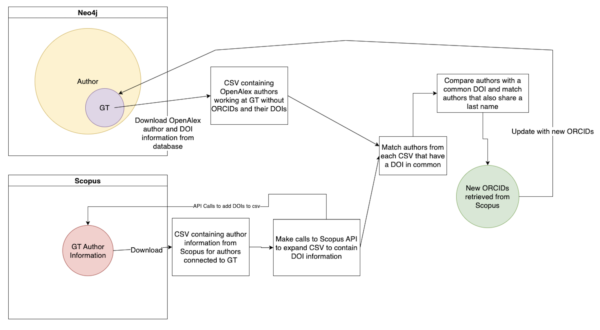
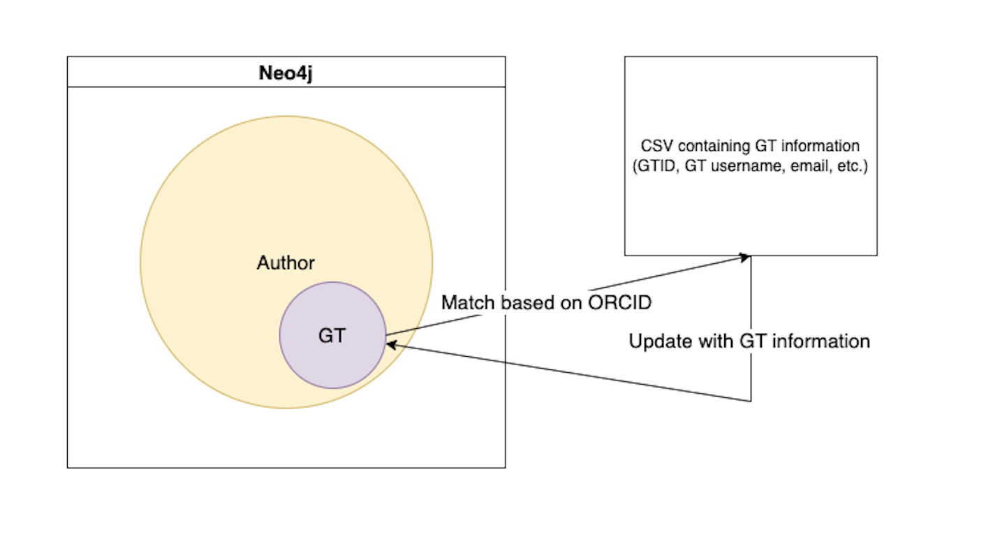
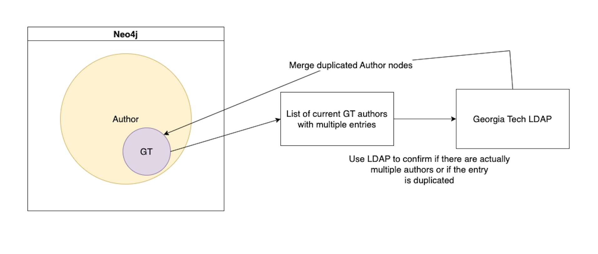

# How to use author disambiguation code
## This folder contains 6 different CSV files  
1. OA_DOI.csv  
Collected from the Neo4j database. Contains authors from the Dev database who are currently working at GT (authors with the GT label) but do not have an ORCID, as well as their respective DOIs. Contains about 16,000 authors. Generated using author_doi.py
2. ORCID_EXPORT_6_14_2023.csv  
Contains internal Georgia Tech data on GT authors. Includes their GTID, GT username, name, email, and ORCID. Contains about 3,000 authors. Received from the GT library.
3. GT_authors_scopus.csv  
Contains the Scopus export of authors connected to Georgia Tech. Contains about 23,000 authors. Retrieved via download from this Scopus webpage of Georgia Tech authors (select all authors, then export CSV):  
https://www.scopus.com/results/authorNamesList.uri?sort=count-f&affiliationId=60019647&src=al&sid=2723475585aa98c3c6d7da0ee598f410&sot=al&sdt=al&sl=16&s=AF--ID%2860019647%29&st1=Georgia+Institute+of+Technology&selectionPageSearch=anl&reselectAuthor=false&activeFlag=true&showDocument=false&resultsPerPage=20&offset=1&jtp=false&currentPage=1&previousSelectionCount=0&tooManySelections=false&previousResultCount=0&authSubject=LFSC&authSubject=HLSC&authSubject=PHSC&authSubject=SOSC&exactAuthorSearch=false&showFullList=false&authorPreferredName=&origin=AffiliationProfile&txGid=216a6a493b015626dc51dbaa7f7df8fb  
4. Scopus_DOI_explode.csv  
Augments above Scopus data with DOIs through the use of API calls. Generated using author_doi.py
5. DOI_Match.csv  
One of the outputs of populate_orcids.py. It is an intermediary file which matches the authors from OpenAlex to their Scopus counterparts which share a DOI. Matches about 100,000 DOIs (although many of these are repeats). Generated using populate_orcids.py.
6. DOI_LastName_Match.csv
Similar to the above file, but also matches based on last name. We can be reasonably sure authors matched in this file are the same person, as they share both a DOI and a last name. Provides about 80 new ORCIDs not already in the database. Generated using populate_orcids.py.

## This folder contains 3 python scripts  
1. author_doi.py
Creates 2 csv files: the OA_DOI file, and the Scopus_DOI_explode file. Connects to the Neo4j database and retreives all authors with the GT label who do not already have an ORCID and puts them into a JSON. The creation of the Scopus_DOI_explode requires the GT_authors_scopus csv to be downloaded from Scopus as shown above. Makes api calls to Scopus to add author DOIs to the Scopus information. At this time takes a very long time to run, so it is suggested you use the csv files already provided.
2. populate_orcids.py
Creates 2 files: DOI_Match.csv matches DOIs from the database to DOIs from SCOPUS. DOI_LastName_Match.csv then matches authors from Scopus and OpenAlex who both share a DOI and a last name. These authors can be reasonable assumed to be the same person, and if Scopus contains an ORCID then that ID is new to the database. It also prints the number of new ORCID IDs.
The procedure of these 2 files is shown in the following diagram:

3. populate_gt_info.py uses the ORCID_EXPORT_6_14_2023.csv and matches ORCID IDs to ones already in the database to update nodes with their Georgia Tech information. Requires the ORCID_EXPORT_6_14_2023.csv file from the library.
The procedure of this file is shown in the following diagram:

With these 2 processes combined, you can locate new ORCIDs from Scopus and add GT data to the authors.

## LDAP Disambiguation
The LDAP folder contains information regarding disambiguation using LDAP

## This folder contains 2 sbatch scripts  
1. download_dois.sbatch runs author_doi.py
2. add_internal.sbatch runs populate_gt_info.py
