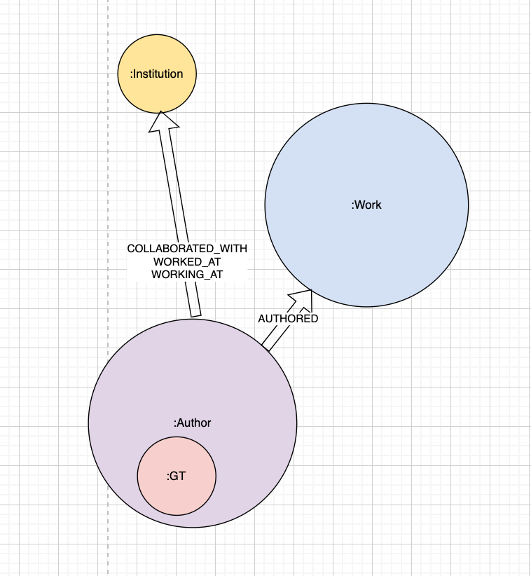
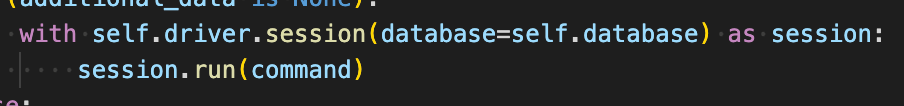

# Neo4J Design Documentation
## OpenAlex Structure
The database is based on Openalex information, so it is important to understand Openalex’s organization in order to understand the database. Openalex separates information into the following entities. The primary entity is the Work entity, which the other entities are based on/connected to.  
  
For the database, we chose to focus on the Work, Author, and Institution entities. The Author and Institution entities are connected to Works in the form of Authorships. Authorships are located in the Work node, and they contain some basic information for the Author and their institutions, as well as the link to pull up the API page for the author/institution with more in-depth information. Each entity in Openalex contains specific properties, and it is organized in json format. Through filtering Openalex in order to only get relevant nodes and information, it is possible to build a database focusing on a Georgia Tech perspective.

## Database Structure
  
There are a few structural points to understand Neo4j. Neo4j allows us to create nodes, which reflect Openalex’s entities. Each node has both label(s) and properties. A label is a title for a node, such as “Author” or “Institution.” Labels are not unique to single nodes (for example, the name of an author should not be a label). Each node can have 1 or more labels. Each node also has properties, which are the unique aspects of a node. The name of an author, for example, would be a property. Properties can be primitive types, strings, or lists. Most importantly, they cannot be dictionaries (however they can be the string representation of a dictionary). The other part of Neo4j is a relationship. A relationship connects 2 nodes, such as an Author WORKING_AT at an Institution. A relationship is directed. A relationship can also have properties, but at the moment no relationships in the database have any. For syntax, a label is generally capitalized (Author), a property is generally lowercase (works_count), and a relationship is generally all capitalized (WORKING_AT).  
The current database contains the following nodes, properties, and relationsips:
Many properties (and their descriptions) are taken directly from Openalex. These properties will have the marker (Openalex) after the property description.
### Nodes
**Author**  
name: The name of the author as a single string, same as the display_name property in Openalex (Openalex)  
cited_by_count: The total number of Works that cite a work this author has created (Openalex)  
created_date: The date this Author object was created in the Openalex dataset (Openalex)  
display_name_alternatives: Other ways the author’s name is displayed in the form of a list of strings (Openalex)  
id: the Openalex ID (Openalex)  
updated_date: The last time anything in this author object changed (Openalex)  
works_api_url: A URL that will get you a list of all this author’s works (Openalex)  
works_count: The number of Works this author has created (Openalex)  
orcid: The ORCID ID for an author (Openalex)  
NOTE: Not every author has every property, as some properties are missing on Openalex.
Additionally, users may find that there seem to be 2 types of authors in the database, those with only a name, id, and orcid property, and those with much more information. In the first case, these authors were added via the authorship property of a work, which has less information. The latter case was added via an Author entity. 

**GT**  
GT nodes are Author nodes with a WORKING_AT relationship with Georgia Tech. Every GT node will also have the Author label and has the same properties.  

**Institution**  
Institution nodes pull all information from Authorships, which is why they do not have all the information from the Openalex Institution entity.  
country_code: Country where this institution is located (Openalex)  
id: the Openalex ID (Openalex)  
name: The primary name of the institution, same as the display_name property in Openalex (Openalex)  
ror: The institutions ROR id (Openalex)  
type: The institution’s primary type (Openalex)  

**Work**  
cited_by_api_url: A url that uses the cites filter to display a list of works that cite this work (Openalex)  
cited_by_count: the number of citations to this work (Openalex)  
corresponding_author_ids: Openalex IDs of any authors for which authorships.is_corresponding is true (Openalex) Note: this property is not updated fully and is often empty  
author_ids: A list of all author ids listed in the authorship property. Not Openalex, added by us.  
corresponding_institution_ids: Openalex IDs of any institution found within an authorship for which authorships.is_corresponding is true (Openalex) Same issues as with correspondind_author_ids.  
created_date: The date this Work object was created in the Openalex dataset (Openalex)  
doi: The DOI for the work (Openalex)  
id: the Openalex ID (Openalex)  
is_paratext: True if we think the work is paratext (Openalex)  
is_retracted: True if we know this work has been redacted (Openalex)  
language: Language of work, automatically detected (Openalex)  
name: Title of the work. Same as display_name on Openalex, and the same as the title property (Openalex)  
publication_date: The day when this work was published (Openalex)  
publication_year: The year this work was published (Openalex)  
referenced_works: Openalex IDs for works that this work cites (Openalex)  
related_works: Openalex IDs for works related to this work, found using an algorithm (Openalex)  
title: Title of the work (Openalex)  
type: Type of the work (Openalex)  
updated_date: The last time anything in this work object changed (Openalex)  

For more information on any properties from Openalex, see Openalex entities overview  

### Relationships
**AUTHORED**  
Author -> Work relationship  
This relationship exists if an Author is listed in the Authorships of a work object  

**WORKED_AT**  
Author -> Institution relationship  
This relationship exists between every Author and all of their institutions per their Authorships in their works  

**WORKING_AT**  
Author -> Institution relationship  
This relationship exists between an Author and their last_known_institution property from Openalex. At the moment, this only exists for authors with a last_known_institution of Georgia Tech  

**COLLABORATED_WITH**  
Author -> Institution relationship  
Only exists for Georgia Tech authors (those with either a WORKING_AT or WORKED_AT relationship with Georgia Tech)  
Connects to all WORKED_AT institutions of collaborators that are not Georgia Tech. For example, Author A works at GT and wrote a paper with Author B. Author B WORKED_AT institution X, Y, and GT. Author A has a COLLABORATED_WITH relationship with institution X and Y.  

## How the Database is Created
First, we query information from Openalex and get all authors with a last_known_institution of Georgia Tech. All of these authors are added into an author json. As we go, we also query every author’s work page. From here, we add all of their works to the work json. As we go through the works, we also iterate through the authorship property and add all institutions to the institutions json, as well as collaborators to a collab json. As we add collaborators to the json, we keep track of their institutions so that a WORKED_AT relationship can be added in later. Next, we filter works by Georgia Tech. This allows us to capture all authors who published under Georgia Tech but may work somewhere different now. Using the same process as before, their collabs and institutions are added to the respective json files.
 
Once everything is in the correct json file, it is important to remove all duplicates from the files. These duplicates are determined by the Openalex ID. For example, if two GT authors worked together, we would add them both for the first author, then again for the second author. Finally, we can begin adding to the database. First, institutions are uploaded. Next collaborators are uploaded (as author nodes) and connected to all of their respective institutions. Because there are so many, collaborators are uploaded in parallel using array jobs. Essentially, 30+ jobs are run at the same time and each upload a different chunk of the json. This must be done because Neo4j has a memory limit, and if you try to upload too many nodes at one time the memory limit will be exceeded, and nothing will be uploaded. Next the authors json is uploaded (containing all the authors WORKING_AT GT), and these nodes are given the additional label of GT and a WORKING_AT relationship with Georgia Tech. Next all of the work nodes are added. Based on the author_ids property, we can then create an AUTHORED relationship between all works and their authors. Finally, the COLLABORATED_WITH relationship can be added with a cypher query.
 
In order to connect to the database, we make use of the GraphDatabase import from Neo4j. You can run cypher on the database using the following command:  
  
Inputting a database option, even if it is the default one, makes the connection much faster. Additionally, sessions are not thread safe. This means that if you want to make use of updating the database in parallel (such as we do with array jobs) it is necessary to create a separate driver object for each array job. Another important thing to keep in mind, especially when uploading in parallel, is deadlocking. When updating a node on Neo4j, there is a lock placed on it until the uploading is complete. This is the reason the uploading scripts use the CREATE keyword instead of MERGE. Create does not interfere with the current graph at all, so there is no chance of a deadlock. On the other hand, MERGE checks through every single node and all but guarantees an eventual deadlock when uploading a large number of nodes. Additional testing also revealed CREATE to be much faster in general when uploading such a large number of nodes. The downside of CREATE, of course, is that it can lead to creating multiple nodes. This is the reason all duplicates are removed from the json file, ensuring each node is only created one time.

## Indexing
Indexes can be added to greatly speed up how long it takes to perform certain queries. These are extremely useful when creating the database, especially when creating WORKED_AT and other relationships. Currently, the database has 2 indexes on author IDs and institution IDs. Each index takes up space, so it’s important to limit the amount of properties indexed in order to keep their speed.  
To create an Index:  
`Create Index for (a:Author) on a.id`

## Filtering on OpenAlex
Most of the data is taken from Openalex using filtering. Queries such as this one: 
https://api.openalex.org/authors?per-page=200&filter=last_known_institution.ror:https://ror.org/01zkghx44&cursor=* 
Allow us to filter by certain Openalex properties, such as last known institution. An important consideration is that Openalex limits the number of authors returned in this fashion. In order to get around this limit and get all desired authors, we use pagination. The addition to the end of the URL with the cursor makes the return json include a ‘cursor’ key in the ‘meta’ section. This key can then be added to the end of a request (after the =) to get the next page, and this process can be repeated in order to get all required results.