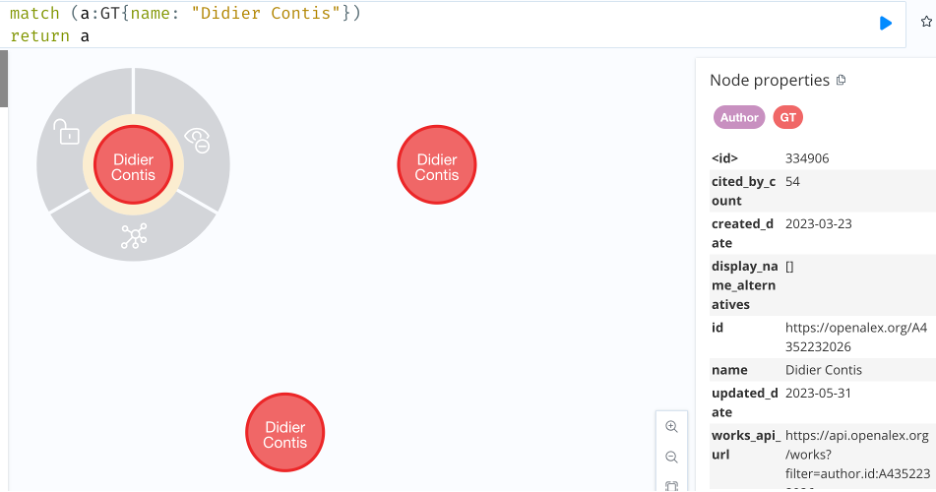
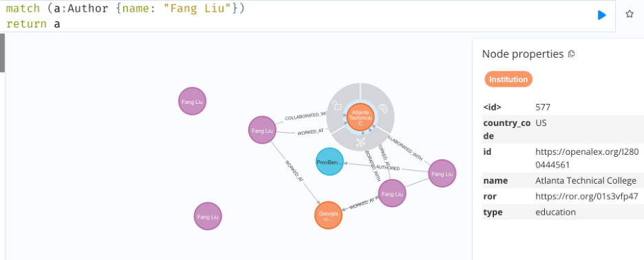

# Technical Report
## Introduction
My work this semester focused primarily on the creation of a pipeline to fill a Neo4j database with the desired OpenAlex information. Python code was chosen to accomplish this task due to the neo4j import, which allows an easy and fast connection to a database. The code, along with the documentation, is located in a GitHub here. In order to update the database quickly and efficiently, the decision was made to run the code on the PACE cluster. Information on how to connect to the cluster and prepare to run the code can be found here. In order to further cut down on the amount of time, we decided to make use of Array jobs to concurrently update the database on the cluster. There are some issues with parallelization and Neo4j, such as deadlocks, which are discussed in the design document on the GitHub. Using the code on the GitHub, it is possible to upload data to Neo4j in three main chunks: downloading, cleaning, and uploading. Ultimately, I was successful in creating a pipeline to put desired Georgia Tech information from OpenAlex into our Neo4j database. This report will discuss some of the main challenges in using the data in OpenAlex, as well as future work to be completed for the project.
## OpenAlex Difficulties and Limitations
As we worked on the project, we encountered many different issues and limitations with the OpenAlex dataset. As we continue to improve the database, it is important to understand what these issues are and how they could possibly affect future work. 
 
The first issue is the poor integration of ORCID IDs. While the field does exist on OpenAlex, a quick inspection of different nodes will reveal that the majority of authors do not yet have their ORCID ID in OpenAlex. OpenAlex points out that this is in part due to some authors, especially past authors, not having ORCID IDs. However, another reason for OpenAlex’s poor implementation of ORCID IDs brings us to our second point: Author repetition and disambiguation. OpenAlex uses an algorithm to disambiguate authors and hopefully avoid repeat instances of the same author, but we still found many examples of it. As an example, we will look at Didier Contis. 
 

 
The current database contains three nodes for Didier. All three nodes have different OpenAlex IDs and works. Additionally, none of the nodes include Didier’s ORCID ID. After discussing with Didier, we were able to potentially identify the source of the problem. The three different nodes seemed to contain the works from when Didier was associated with different parts of Georgia Tech, such as the College of Engineering versus the School of Electrical and Computer Engineering. This issue arises from OpenAlex’s emphasis on Work nodes. The Work nodes are disambiguated very well in OpenAlex, and other information comes from the Works. If OpenAlex is confident in 2 authors being the same person, it will combine them. If there is any doubt, however, it will choose to create multiple different nodes. This design decision leads to the issue with ORCIDs, as OpenAlex does not know which node to assign the ORCID ID to, and instead leaves it out entirely.  
 
Another issue involves incorrect information in OpenAlex. Looking at another author, Fang Liu. In this case, not only are there multiple nodes, but there is also incorrect information. 
 

 
Not only is Georgia Tech not listed as the last known institution, but there is also a WORKED_AT relationship with Atlanta Technical College. Similar to before, this issue seems to stem from OpenAlex’s focus on the Work node. Every Work contains a “raw affiliation string” for an author. OpenAlex parses through this string and pulls the relevant institution. In this case, the affiliation string contains “Georgia Tech, Atlanta, GA.” From this string, OpenAlex pulls the “Atlanta” and “Tech” portions and attributes the work to Atlanta Technical College (as well as Georgia Tech). This issue is not unique to Atlanta Technical College, and we believe it creates many relationships, especially COLLABORATED_WITH relationships, which should not exist. This raises issues when trying to determine the institutions Georgia Tech has collaborated with the most, for example. This parsing of the raw affiliation string can lead to other issues as well, such as schools within a college being counted as a separate institution.
## Future Work
While we have made significant progress, there are still important areas of focus for future work. The first is implementing a script to automatically run and update the database. This would involve downloading the most up-to-date data from the database and uploading it at scheduled times. There should also be different checkpoints during the update to ensure there are not any major issues which need human intervention. One example of such a check could if the number of nodes in the database changes dramatically, rather then the relatively small amount expected in incremental updates. Another goal is implementing version control for the database. If a problamatic update is not caught by any checks, it is important to have a way to revert the database to the previous state. This can be accomplished using the input files, as simply saving previous versions of the cleaned data would allow the database to be recreated. However, there may be some better tools which merit investigation.
 
Another important piece of future work is author disambiguation and deduplication. A single author with multiple nodes not only skews our statistics, but it also makes it more difficult to integrate other datasets. For example, one major goal is updating Georgia Tech authors with more information, such as GTID and email. With duplicated authors, it is difficult to tell which author node to apply the information to, as it is not known whether there are actually multiple authors with the same name, or if they are the same person. Utilizing SCOPUS and other databases could help disambiguate authors based on their works, as OpenAlex focuses on the correctness of works.
 
On July 21, 2023 OpenAlex updated their database and implemented some major changes to author disambiguation. An important piece of future work will be integrating this new data and investigating the improved accuracy. OpenAlex created new Author objects with new IDs (beginning with a 5) for the updated authors. OpenAlex claims that these new Objects have decreased duplication and stronger ORCID ID integration. After injecting the new OpenAlex data into a fresh test database (on 8/2/23), there are 281,487 author nodes. This is in comparison to the 338,785 author nodes in the original database. In the original database, there were 39,614 authors with an ORCID ID. In the new database, there are 140,374 authors with an ORCID ID. This increase in ORCID IDs will make it significantly easier to match our author nodes to the same authors in other databases.  

	                                Before Update	After Update  
Authors in Database	                338,785	        281,497  
Authors with ORCID ID	            39,614	        140,374  
Authors where at least one          118,602	        35,004  
other Author shares the same name	  

The table above shows the changes in data. OpenAlex clearly has a focus on removing the duplicated authors, something very helpful to this project. In regards to the numbers on authors sharing the same name, it is important to recognize how the query works. At first, it may seem odd that this number drops by more then the authors in the database. If there were 2 authors named “Tom,” that would add 2 authors to the total, as they both “share” a name with another node. However, if one “Tom” is removed, the remaining node is not added to the total because it no longer shares a node. Essentially, removing one node from the graph will often remove 2 nodes from the number of authors sharing names. The most important lesson to take away from this update is that OpenAlex can implement large changes on the database at any time. There is a forum here which should announce any updates to the database. Once the database is schedulued to update automatically, it is important to catch cases such as these so that the database is not filled with data which is in the process of being updated. Additionally, while the data upload pipeline still works with this update, it is possible OpenAlex could change something (such as a field name) which would require our code to be edited. 
 
