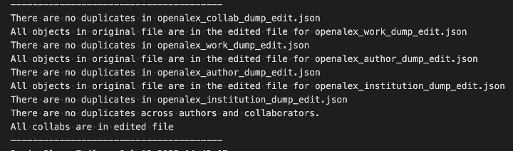
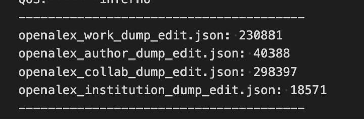

# Tests for Creating the Database
Three main phases to test: 
Downloading Data 
Cleaning Data 
Uploading Data 

## Downloading Data
When downloading the GT authors, you can make sure all authors were downloaded by checking the same openalex api link that we download the authors from.  
https://api.openalex.org/authors?filter=last_known_institution.ror:https://ror.org/01zkghx44  
The second line contains the count of authors. Combines with the check_num_in_json() method, this can ensure that all authors are included. Note that if the download was not done recently, the openalex may have added more authors.  
For the other node types, it is not possible to directly query openalex to get a count to compare the json to.  However, it is important to check the output file for the download in order to determine if everything went correctly. If there is no error message, the download was successful. If there was a connection error, there was an issue connecting to the webpage to receive the data. If there was a timeout error, that means the request timed out. Additionally, a timeout error is retried three times before the program cancels, so if the error is in the output file all 3 attempts resulted in an error.

## Cleaning Data
Once the data is in the json, it is important to check a few different things:
1.	Ensure that when the data was cleaned, no data was completely removed from the json
Essentially, it is important to make sure that for every openalex ID in the original data, that openalex id also appears in the edited data. This way, we can ensure that no data was lost. This does not apply to the collaborator json, as will be explained later.
2.	Ensure that there are no duplicates in each file
Next, it is important to ensure that each file does not contain multiple of the same openalex ids.
3.	Ensure that no author in the authors json also appears in the collaborator json
If an author appears in both the collaborator and author json files, the editing should condense it to just the entry in author (as this includes the most data). Iterate through each author and make sure that openalex ID does not appear in collaborators as well.
4.	Finally, ensure that no collaborators were lost.
In order to check this, ensure that every id in collaborator appears in the edited collab json or the edited author json.
There is a SlurmJob method (run_tests_on_cleaning()) to automatically create and submit a job for the above tests. The output file looks like this:  
  
Using this, it is easy to run the tests. The tests take about 4.5 minutes to run completely.

## Uploading Data
Must ensure that every object in each Json is uploaded. There is a function in SlurmJob, print_nums_in_file(), which will create and submit a job to count the number of each type of node. The output is the following:  
  
Use the following queries to ensure that the number in the json and the number uploaded to Neo4j are the same:  
`MATCH (a:Work) return count(a)`  
`MATCH (a:GT) return count(a)`  
`MATCH (a:Author) where not a:GT return count(a)`  
`MATCH (a:Institution) return count(a)`    
Finally, these queries will test the COLLABORATED_WITH relationship.  
**First Query**  
`MATCH (a:GT)`  
`WITH a`  
`MATCH (a) -[:AUTHORED]- (c:Work)`  
`WITH c, a`  
`MATCH (d:Author) –[:AUTHORED]- (c) where d <> a`  
`WITH d, a`  
`MATCH (d) –[:WORKED_AT]- (x:Institution) where x.name <> “Georgia Institute of Technology”`  
`WITH a, x`  
`MATCH (a) where exists((a) –[:COLLABORATED_WITH]- (x)) = false`    
**Second Query**   
`MATCH (a:Author) –[:WORKED_AT]- (:Institution {name: “Georgia Institute of Technology”})`  
`WITH a`  
`MATCH (a) -[:AUTHORED]- (c:Work)`  
`WITH c, a`  
`MATCH (d:Author) –[:AUTHORED]- (c) where d <> a ` 
`WITH d, a`  
`MATCH (d) –[:WORKED_AT]- (x:Institution) where x.name <> “Georgia Institute of Technology”`  
`WITH a, x`  
`MATCH (a) where exists((a) –[:COLLABORATED_WITH]- (x)) = false`    
Essentially, both of these queries search for where there should be a COLLABORATED_WITH relationship but there is not, and returns the nodes. Both of these queries should return no records.