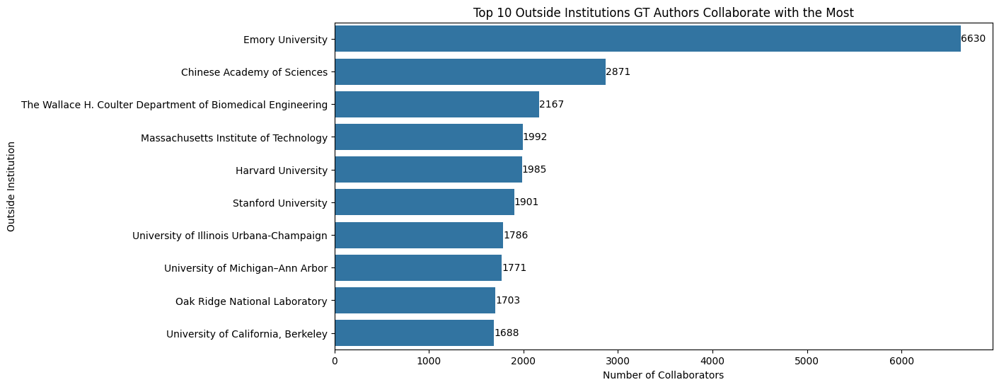
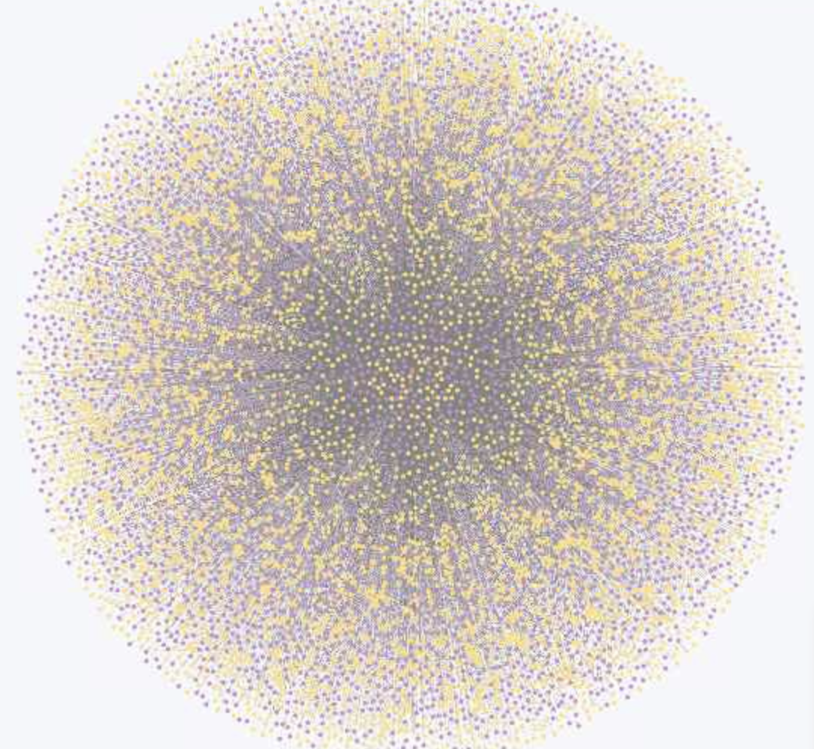
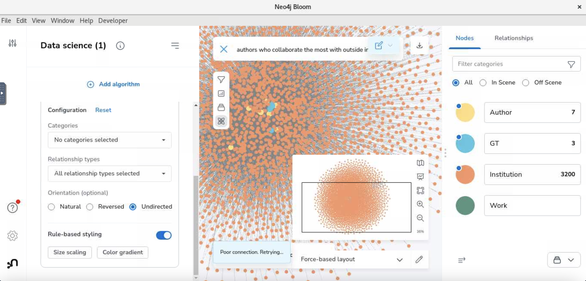

# Use Cases

## Introduction
this folder contains scripts and visualization using cypher queries and python for our current Neo4j database
-  `high_level_metrics.ipynb` contains all the statistics and metrics of our Dev database using cypher queries. There also includes more complicated collaboration metrics and work related metrics as well as the generated graphs.
 
## Running Jupyter Notebook Files with Neo4j Integration

This guide will walk you through the steps to run Jupyter Notebook files (.ipynb) that use the Neo4j package for integration with Neo4j databases, all from the terminal. The scripts already contain credentials and code to make connection to our Neo4j dev database, you will need to connect to the GT internet via campus Wifi or Georiga Tech VPN.

### Prerequisites

- Python installed on your system

### Step One: Setup Environment
To use the notebook, first set up an environment. If you already have a python environment, you can skip this step. Otherwise, download miniconda from
the following link: <br>
https://docs.conda.io/projects/miniconda/en/latest/ <br>
Create a new conda environment and open it with the following commands (press [y] when prompted): <br>
```conda create --name neo4j``` <br>
Next, use this command to activate the environment: <br>
```conda activate neo4j``` <br>
Finally, install pip with the following command (press [y] when prompted): <br>
```conda install pip```

### Step Two: Install Packages
Once your conda environment is activated, use the following commands to install the necessary packages: <br>
```pip install neo4j``` <br>
```pip install requests``` <br>
```pip install jupyter ``` <br>
```pip install pandas``` <br>
```pip install matplotlib``` <br>
```pip install seaborn``` <br>

### Step Three: Use Jupyter Notebook
Inside the Jupyter Notebook interface, you can run cells individually or run all cells by selecting Run > Run All Cells from the top menu.
The first cells in the notebook are for connecting to Neo4j. You must input your Neo4j username and password to access the database, and you must be connected to the GT VPN. For more information on both of these, view the README in backend. The first cells allow you to get metrics on the dev database. Scroll to Query 1 for the first major query. This query ranks the outside institutions GT authors collaborate with the most, and includes the ability to create a graph. Query 2 ranks the GT authors who have worked with the most outside collaborators. Query 3 tracks the institutions GT authors move between the most. Query 4 tracks the authors with the most works.


## Neo4j Bloom Graph Visualizations
### Step One: Connect to PACE OpenOnDemand
In order for the visualizations to run in reasonable amounts of time, it is recommended to connect to OpenOnDemand for more resources. If you do not have a PACE account, follow the steps listed in the README for the backend folder. You must also be connected to the Georgia Tech VPN, and step-by-step instructions can be found in the backend README. Click on the following link to access the service: <br>
https://gatech.service-now.com/home?id=kb_article_view&sysparm_article=KB0042133 <br>
From this page, click on "Phoenix OnDemand." Next, click on "Interactive Apps" on the menu bar in the top left, then select "Interactive Desktops." Now you can request a desktop with the specifications you need. Many fields already have values. For the charge-account use "phoenix-testusers," and select a number of nodes from one to four for less or more power. 4 cores is suggested. You can also select how long to have access to the desktop. Click "Launch." It may take a few minutes to gain access to the desktop. Once on the interactive desktop, click "Activities" in the top left and select the web browser. Go to the following link: <br>
https://neo4j.com/developer/kb/convert-an-appimage-file-into-executable-on-linux-ubuntu-debian/ <br>
Next, click on the link that says "A quicker way to install." Press "Download" and fill out the form. Download Neo4j dekstop and copy the activation key to the clipboard. Click "Activities" and open the terminal. Run each of the following commands: <br>
```
cd Downloads
chmod a+x neo4j-desktop-<version>-x86_64.AppImage
./neo4j-desktop-<version>-x86_64.AppImage --no-sandbox
```
Replace <version> with the version of Neo4j desktop you downloaded. For example, 1.5.9. Once Neo4j Desktop is open, paste the key in to unlock functionality. You can set up a remote connection to the database as detailed here:<br>
https://gatech.service-now.com/home?id=kb_article_view&sysparm_article=KB0042169<br>
### Step Two: Running Visualizations
Once connected to the database, click the 4 squares on the left side of the screen and launch Neo4j Bloom. When starting a new perspecive, click the three lines in the top left and add a category for each label. Here you can select which color to use for the different labels, such as setting Authors to yellow. Then click on "Saved Cypher" and add a new search phrase. You can add any cypher query you would like here. Copy the query to the clipboard, then use Edit -> paste to paste the query into the Cypher Query section. Here are some suggestions.

### Top 10 GT Authors Who Collaborate with the Most Outside Institutions
This query focuses on GT author collaboration with outside institutions. A "GT author" is either an author with a WORKING_AT or WORKED_AT relationship with Georgia Tech. This means that the author either currently works at Georgia Tech or has some time in the past, according to our information. The graphs displays these authors connected to institutions they have collaborated with. Collaboration entails co-authoring a work with another author from this institution, and is represented by the COLLABORATED_WITH relationship. 
```
MATCH (a:Author) -[:WORKED_AT|WORKING_AT]- (i:Institution {name: "Georgia Institute of Technology"})
MATCH (a) -[r:COLLABORATED_WITH]- (i2:Institution) where i <> i2
with a, collect({instiution: i2, relationship: r}) as collabs, count(distinct i2) as num
order by num desc
return a, collabs
limit 10
```


### Top 10 Outside Institutions Who Collaborate With the Most GT Authors
This query is a reverse of the previous query. It matches the top 10 institutons with the most COLLABORATED_WITH relationships with GT authors (as described above). In the example graph, nodes with the GT label are displayed in purple, and nodes with just the Author label are displayed in yellow. It is also important to note the 10,000 node limit in Neo4j bloom, which prevents the full results of the query from being displayed.
```
MATCH (a:Institution) -[r:COLLABORATED_WITH]- (b:Author) -[:WORKED_AT|WORKING_AT]- (c:Institution {name: "Georgia Institute of Technology"})
where a <> c
with a, collect({author: b, relationship: r}) as collabs, count(distinct b) as num
order by num desc
return a, collabs
limit 10
```
 
 
### Using GDS (Graph Data Science) 
Note that you can change the number of nodes displayed on the screen in settings. On the left side of the screen, you will see a vertical bar with 4 icons. The bottom icon is for GDS. Click on the icon, then "Add Algorithm." Select "Page Rank Centrality," then settings. Change the orientation from Natural to Undirected. Then click apply algorithm. You can click "Size Scaling" and "Color Gradiant" to have the changes reflected in the graph visually. For example, if you select "Size Scaling," then the nodes with the most connections will be the largest. GDS also gives other algorithms which may be useful. Page Rank will indicate which nodes are more important based on the number of relationships a node has. For example, nodes with more relationships will be displayed as larger when using "Size Scaling."


